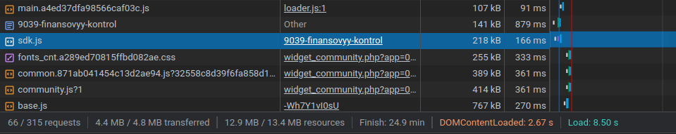
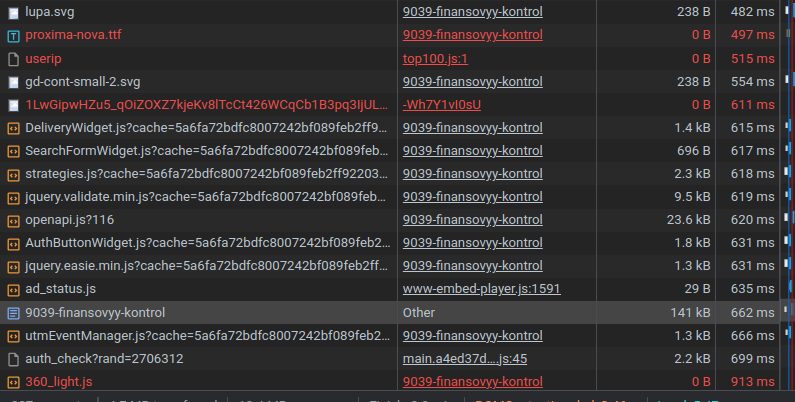
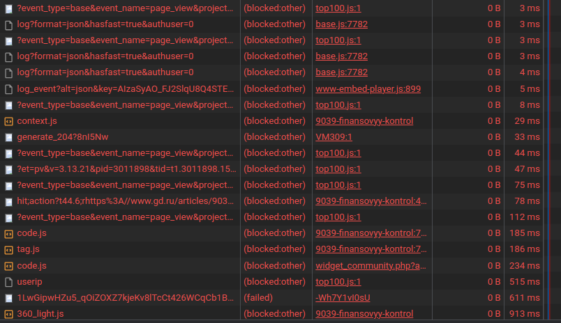
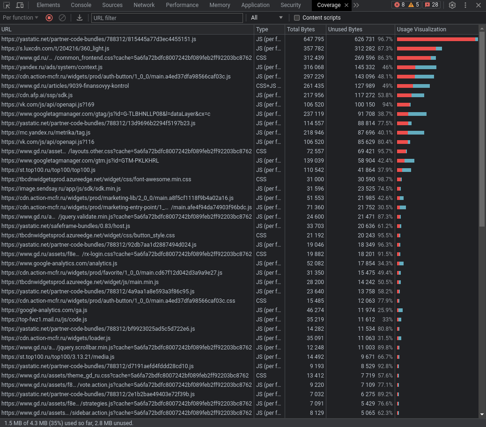

# Chrome DevTools

## Network

Дублирование запроса на сервер `www.1cont.ru` для получения одинакового изображения


Лишний размер ресурса наблюдается у ресурсов `base.js`, `community.js`, `sdk.js`


Долгая загрузка у `auth_check`, `utmEventManager.js`, самого документа


Много блокирующих ресурсов: `360_light.js`, `code.js`, `tag.js`, `userip`, `context.js`


## Performance

#### Время событий

- FP: 731.90ms
- FCP: 731.90ms
- LCP: 1.3s
- DCL: 5.33s
- L: 15.53s

#### LCP DOM элемент

Заголовок страницы является LCP элементом

```css
body > div.container-fluid.defaultBackground > div.row.body__wrapper > div.body > div > div.frontpageTop__content.frontpageTop__content_inside.frontpageTop__content_article-item > div.row > div:nth-child(2) > h1
```

#### Время этапов

- Loading: 225ms
- Scripting: 4849ms
- Rendering: 2124ms
- Painting: 119ms

## Coverage

#### Unused CSS: 563kB

#### Unused JS: 2355kB


